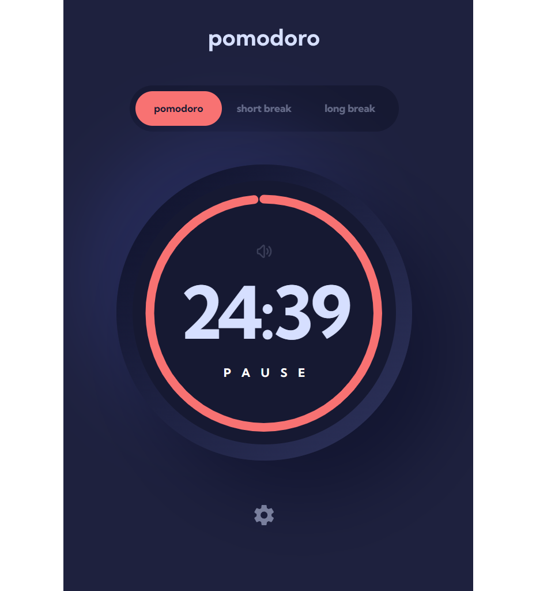

# Frontend Mentor - Pomodoro app solution

This is a solution to the [Pomodoro app challenge on Frontend Mentor](https://www.frontendmentor.io/challenges/pomodoro-app-KBFnycJ6G). Frontend Mentor challenges help you improve your coding skills by building realistic projects.

## Table of contents

- [Overview](#overview)
  - [The challenge](#the-challenge)
  - [Screenshot](#screenshot)
  - [Links](#links)
- [My process](#my-process)
  - [Built with](#built-with)
  - [What I learned](#what-i-learned)
  - [Useful resources](#useful-resources)
- [Author](#author)

## Overview

### The challenge

Users should be able to:

- Set a pomodoro timer and short & long break timers
- Customize how long each timer runs for
- See a circular progress bar that updates every minute and represents how far through their timer they are
- Customize the appearance of the app with the ability to set preferences for colors and fonts

### Screenshot

### Links

- Solution URL: [https://github.com/aleksFedotov/pomodoro-app]
- Live Site URL: [https://aleksfedotov.github.io/pomodoro-app/]

## My process

### Built with

- Semantic HTML5 markup
- Flexbox
- Desktop-first workflow
- [React](https://reactjs.org/) - JS library
- [Styled Components](https://styled-components.com/) - For styles

**Note: These are just examples. Delete this note and replace the list above with your own choices**

### What I learned

Using Middleware on Redux-Toolkit to store settings in local storage

Progress bar using SVG

### Useful resources

- [Readux Toolkit Middleware](https://redux-toolkit.js.org/api/getDefaultMiddleware) - Redux Toolkit Docs about customizing Middleware

## Author

- Frontend Mentor - [@aleksFedotov](https://www.frontendmentor.io/profile/aleksFedotov)
